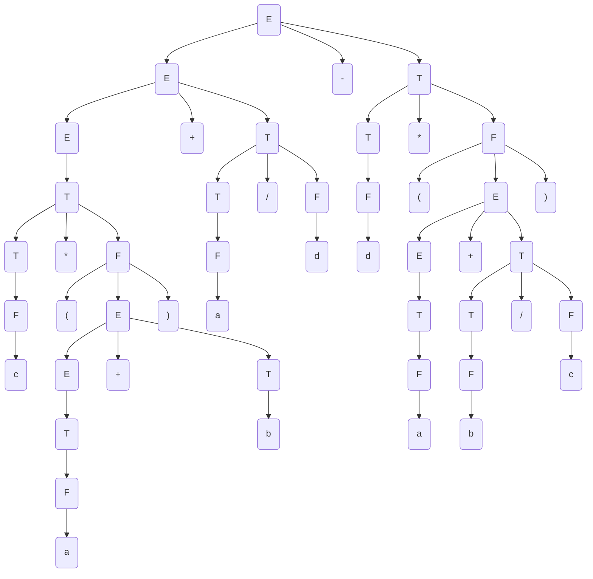
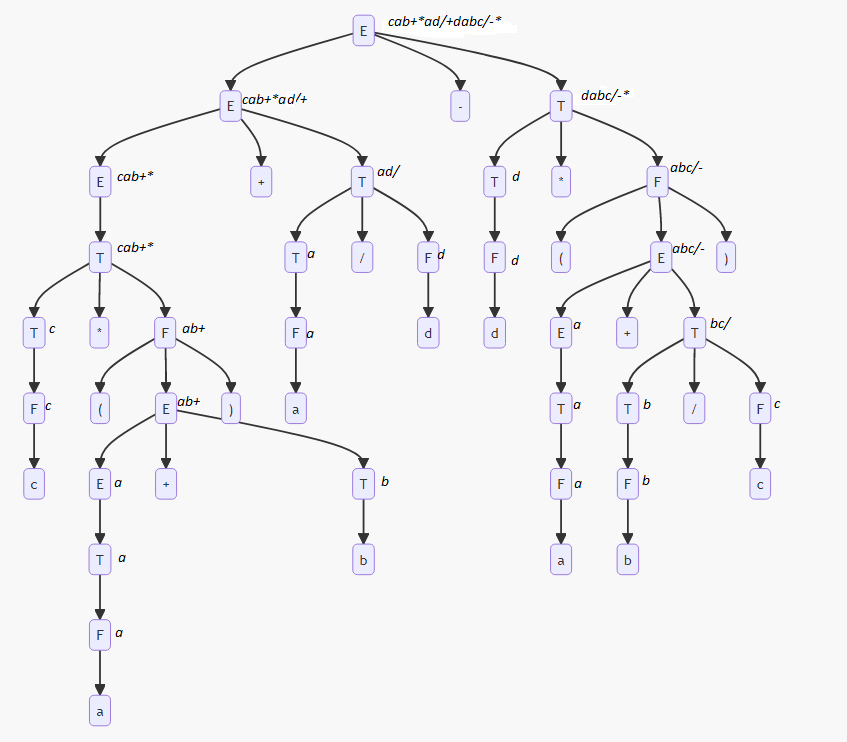

Tema: *Forma postfix*.

A realizat: *Curmanschii Anton, MIA2201*.

## Sarcina

Este dată gramatica independentă de context

$ G = (V_N, V_T, P, S), V_N = \\{E, T, F \\}, V_T = \\{a ,b, c, d, +, -, *,/, (, )\\} $

$ P = \begin{cases}
E \rightarrow T \\\\
E \rightarrow E + T \\\\
E \rightarrow E - T \\\\
T \rightarrow T * F \\\\
T \rightarrow T / F \\\\
T \rightarrow F \\\\
F \rightarrow (E) \\\\
F \rightarrow a \\\\
F \rightarrow b \\\\
F \rightarrow c \\\\
F \rightarrow d \\\\
\end{cases} $

Aplicând schema de traducere dirijată prin sintaxă cu atributul sintetizat postfix construiţi notaţia postfix pentru expresia  $ c * (a + b) + a / d - d * (a + b / c) $.

## Derivarea cuvântului

$ E \xrightarrow{E \rightarrow E - T} E - T $

$ E - T \xrightarrow{E \rightarrow E + T} E + T - T $

$ E + T - T \xrightarrow{E \rightarrow T} T + T - T $

$ T + T - T \xrightarrow{T \rightarrow T * F} T * F + T - T $

$ T * F + T - T \xrightarrow{T \rightarrow F} F * F + T - T $

$ F * F + T - T \xrightarrow{F \rightarrow c} c * F + T - T $

$ c * F + T - T \xrightarrow{F \rightarrow (E)} c * (E) + T - T $

$ c * (E) + T - T \xrightarrow{E \rightarrow E + T} c * (E + T) + T - T $

$ c * (E + T) + T - T \xrightarrow{E \rightarrow T} c * (T + T) + T - T $

$ c * (T + T) + T - T \xrightarrow{T \rightarrow F} c * (F + T) + T - T $

$ c * (F + T) + T - T \xrightarrow{F \rightarrow a} c * (a + T) + T - T $

$ c * (a + T) + T - T \xrightarrow{T \rightarrow F} c * (a + F) + T - T $

$ c * (a + F) + T - T \xrightarrow{F \rightarrow b} c * (a + b) + T - T $

$ c * (a + b) + T - T \xrightarrow{T \rightarrow T / F} c * (a + b) + T / F - T $

$ c * (a + b) + T / F - T \xrightarrow{T \rightarrow F} c * (a + b) + F / F - T $

$ c * (a + b) + F / F - T \xrightarrow{F \rightarrow a} c * (a + b) + a / F - T $

$ c * (a + b) + a / F - T \xrightarrow{F \rightarrow d} c * (a + b) + a / d - T $

$ c * (a + b) + a / d - T \xrightarrow{T \rightarrow T * F} c * (a + b) + a / d - T * F $

$ c * (a + b) + a / d - T * F \xrightarrow{T \rightarrow F} c * (a + b) + a / d - F * F $

$ c * (a + b) + a / d - F * F \xrightarrow{F \rightarrow d} c * (a + b) + a / d - d * F $

$ c * (a + b) + a / d - d * F \xrightarrow{F \rightarrow (E)} c * (a + b) + a / d - d * (E) $

$ c * (a + b) + a / d - d * (E) \xrightarrow{E \rightarrow E + T} c * (a + b) + a / d - d * (E + T) $

$ c * (a + b) + a / d - d * (E + T) \xrightarrow{E \rightarrow T} c * (a + b) + a / d - d * (T + T) $

$ c * (a + b) + a / d - d * (T + T) \xrightarrow{T \rightarrow F} c * (a + b) + a / d - d * (F + T) $

$ c * (a + b) + a / d - d * (F + T) \xrightarrow{F \rightarrow a} c * (a + b) + a / d - d * (a + T) $

$ c * (a + b) + a / d - d * (a + T) \xrightarrow{T \rightarrow T / F} c * (a + b) + a / d - d * (a + T / F) $

$ c * (a + b) + a / d - d * (a + T / F) \xrightarrow{T \rightarrow F} c * (a + b) + a / d - d * (a + F / F) $

$ c * (a + b) + a / d - d * (a + F / F) \xrightarrow{F \rightarrow b} c * (a + b) + a / d - d * (a + b / F) $

$ c * (a + b) + a / d - d * (a + b / c) \xrightarrow{F \rightarrow c} c * (a + b) + a / d - d * (a + b / c) $

## Arborele de derivare

## Derivarea notației postfix

| Reguli sintactice       | $ p $                   |
|-------------------------|-------------------------|
| $ E \rightarrow T $     | $ p.0 = p.1 $           |
| $ E \rightarrow E + T $ | $ p.0 = p.1 ~ p.3 ~ + $ |
| $ E \rightarrow E - T $ | $ p.0 = p.1 ~ p.3 ~ - $ |
| $ T \rightarrow T * F $ | $ p.0 = p.1 ~ p.3 ~ * $ |
| $ T \rightarrow T / F $ | $ p.0 = p.1 ~ p.3 ~ / $ |
| $ T \rightarrow F $     | $ p.0 = p.1 $           |
| $ F \rightarrow (E) $   | $ p.0 = p.2 $           |
| $ F \rightarrow a $     | $ p.0 = a $             |
| $ F \rightarrow b $     | $ p.0 = b $             |
| $ F \rightarrow c $     | $ p.0 = c $             |
| $ F \rightarrow d $     | $ p.0 = d $             |

$ c a b + * a d / + d a b c / \- * - $