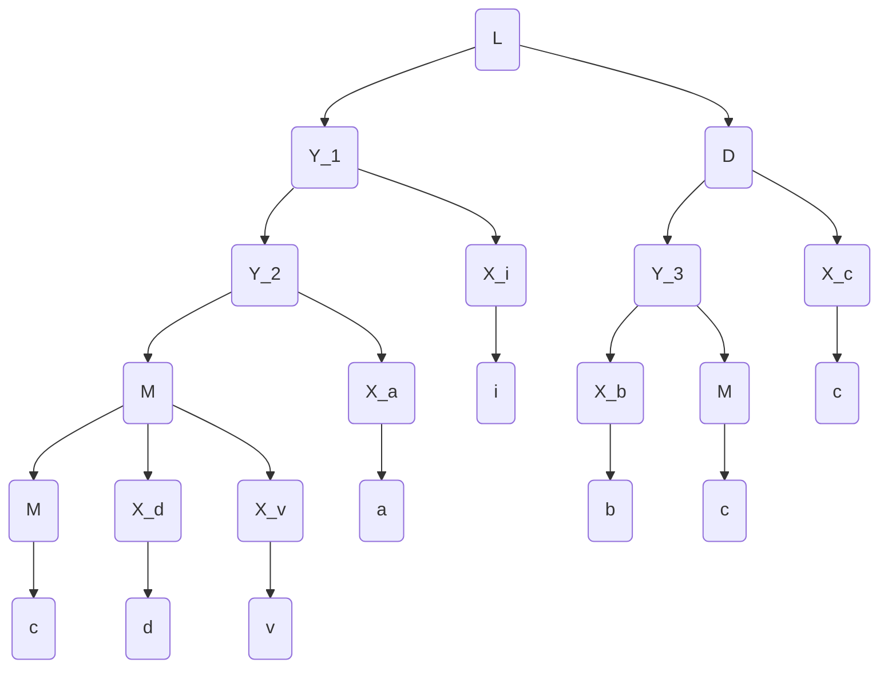

Tema: *Algoritmul Cocke-Younger-Kasami*.

A realizat: *Curmanschii Anton, MIA2201*.

## Sarcina

$ G=(V_N, V_T, P, S), V_N = \\{S,D,L,M\\}, V_T = \\{a, b, c, d, i, v \\} $

$ P = \begin{cases}
S \rightarrow L \\\\
L \rightarrow MaiD | i \\\\
D \rightarrow bMc \\\\
M \rightarrow c | Mdv \\\\
\end{cases} 
$

Generați un cuvânt alcătuit din 5-7 simboluri.

Efectuați analiza sintactică utilizând algoritmul Cocke-Younger-Kasami.

Desenați arborele de derivare.

## Generarea unui cuvânt

$ S \xrightarrow{S \rightarrow L} L $

$ L \xrightarrow{L \rightarrow M a i D} MaiD $

$ MaiD \xrightarrow{M \rightarrow M d v} MdvaiD $

$ MdvaiD \xrightarrow{M \rightarrow c} cdvaiD $

$ D \xrightarrow{D \rightarrow b M c} cdvaibMc $

$ M \xrightarrow{M \rightarrow c} cdvaibcc $

## Normalizarea gramaticii

1. Se elimină $ \varepsilon $. Nu-s.
   
2. Se elimină regulile singulare.

$S \rightarrow L$ este o regulă singulară.
Poate fi pur și simplu eliminată, facând $ L $ simbolul de start.  
   
3. Se elimină regulile inaccesibile. Toate regulile sunt evident accesibile.
   
4. Se elimină regulile inutile. Toate regulile sunt evident utile.

## Aducerea la forma normală Chomsky

Introducem câte o regulă $ X_i $ pentru fiecare terminal $ i $ care apare în cel puțin o producție compusă (conține mai mult decât un singur simbol pe partea dreapta). Acestea sunt toate simbolurile terminale.

$ P ^ {\prime} = \begin{cases}
L \rightarrow MaiD | i \\\\
D \rightarrow bMc \\\\
M \rightarrow c | Mdv \\\\
X_a \rightarrow a \\\\
X_b \rightarrow b \\\\
X_c \rightarrow c \\\\
X_d \rightarrow d \\\\
X_i \rightarrow i \\\\
X_v \rightarrow v \\\\
\end{cases} 
$

Acum substituim așa neterminale la aceste reguli noi.

$ P ^ {\prime \prime} = \begin{cases}
L \rightarrow M X_a X_i D | i \\\\
D \rightarrow  X_b M X_c \\\\
M \rightarrow M X_d X_v | c \\\\
X_a \rightarrow a \\\\
X_b \rightarrow b \\\\
X_c \rightarrow c \\\\
X_d \rightarrow d \\\\
X_i \rightarrow i \\\\
X_v \rightarrow v \\\\
\end{cases} 
$

Acum trecem la al doilea caz, adică regulile unde pe partea dreapta avem mai mult ca două simboluri neterminale.

$ L \rightarrow M X_a X_i D \xrightarrow{Y_1 \rightarrow M X_a X_i} L \rightarrow Y_1 D $

$ Y_1 \rightarrow M X_a X_i \xrightarrow{Y_2 \rightarrow M X_a} Y_1 \rightarrow Y_2 X_i $

$ D \rightarrow  X_b M X_c \xrightarrow{Y_3 \rightarrow X_b M} D \rightarrow Y_3 X_c $

$ M \rightarrow M X_d X_v \xrightarrow{Y_4 \rightarrow M X_d} M \rightarrow Y_4 X_v $

$ P ^ {\prime \prime} = \begin{cases}
L \rightarrow Y_1 D | i \\\\
Y_1 \rightarrow Y_2 X_i \\\\
Y_2 \rightarrow M X_a \\\\
D \rightarrow Y_3 X_c \\\\
Y_3 \rightarrow X_b M \\\\
M \rightarrow Y_4 X_v | c \\\\
Y_4 \rightarrow M X_d \\\\
X_a \rightarrow a \\\\
X_b \rightarrow b \\\\
X_c \rightarrow c \\\\
X_d \rightarrow d \\\\
X_i \rightarrow i \\\\
X_v \rightarrow v \\\\
\end{cases} 
$

## Derivarea

| $ c     $ | $ d   $ | $ v   $ | $a   $ | $ i     $ | $b  $  | $c    $ | $c$     |
|-----------|---------|---------|--------|-----------|--------|---------|---------|
| $ M,X_c $ | $ X_d $ | $ X_v $ | $X_a $ | $ L,X_i $ | $X_b$  | $M,X_c$ | $M,X_c$ |
| $ Y_4   $ | -       | -       | -      | -         | $Y_3 $ | -       |         |
| $ M     $ | -       | -       | -      | -         | $D$    |         |         |
| $ Y_2   $ | -       | -       | -      | -         |        |         |         |
| $ Y_1   $ | -       | -       | -      |           |        |         |         |
| -         | -       | -       |        |           |        |         |         |
| -         | -       |         |        |           |        |         |         |
| $ L$      |         |         |        |           |        |         |         |

