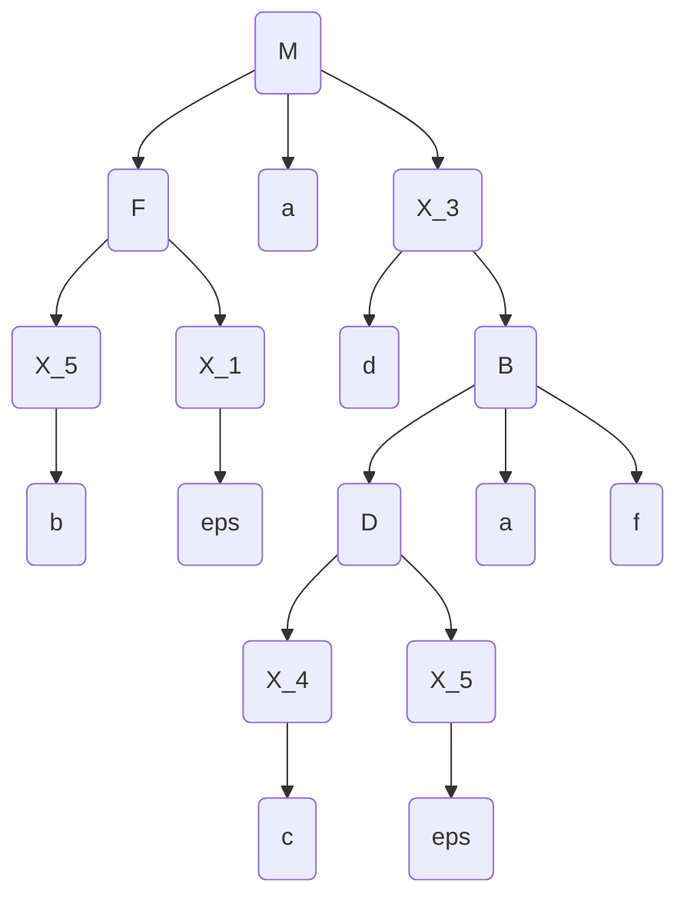

Tema: *LL(1)*.

A realizat: *Curmanschii Anton, MIA2201*.


## Sarcina

Fie gramatica independentă de context 

$ G = (V_N, V_T, P, S), V_N = \\{M, B, D, F \\}, V_T = \\{a, b, c, d, e\\} $

$ P = \begin{cases}
M \rightarrow F a | F a d B \\\\
B \rightarrow D a f \\\\
D \rightarrow c | D e c \\\\
F \rightarrow b | F e b \\\\
\end{cases} $

Să se construiască tabelul de analiză LL(1) şi să se analizeze şirul **badcaf**.
Să se deseneze arborele de derivare.

## Normalizarea

Necesită să eliminăm recursia stângă, introducând o regulă epsilon.

Regula $ F \rightarrow F e b $ manifestă recursia stângă.
Eliminăm regulile lui $ F $, introducem regulile  $ F \rightarrow b X_1 | e b X_1 $ și $ X_1 \rightarrow \varepsilon | F X_1 $

$ P ^ {\prime} = \begin{cases}
M \rightarrow F a | F a d B \\\\
B \rightarrow D a f \\\\
D \rightarrow c | D e c \\\\
F \rightarrow b X_1 | e b X_1 \\\\
X_1 \rightarrow \varepsilon | F X_1 \\\\
\end{cases} $

$ D \rightarrow D e c $ tot este așa regulă.

$ P ^ {\prime \prime} = \begin{cases}
M \rightarrow F a | F a d B \\\\
B \rightarrow D a f \\\\
D \rightarrow c X_2 | e c X_2 \\\\
X_2 \rightarrow \varepsilon | D X_2 \\\\
F \rightarrow b X_1 | e b X_1 \\\\
X_1 \rightarrow \varepsilon | F X_1 \\\\
\end{cases} $


Acum mai este necesar să se facă factorizarea.
Trebuie să factorizăm regulile lui $ M $ (ambele se încep cu $ F a $).

Adaugăm regulile noi, $ X_3 \rightarrow d B | \varepsilon $, și $ M \rightarrow F a X_3 $, eliminând regulile lui $ M $.

$ P ^ {\prime \prime \prime} = \begin{cases}
M \rightarrow F a X_3 \\\\
X_3 \rightarrow d B | \varepsilon
B \rightarrow D a f \\\\
D \rightarrow c X_2 | e c X_2 \\\\
X_2 \rightarrow \varepsilon | D X_2 \\\\
F \rightarrow b X_1 | e b X_1 \\\\
X_1 \rightarrow \varepsilon | F X_1 \\\\
\end{cases} $

Cred că factorizarea dreapta tot trebuie să fie eliminată (?).

$ P ^ {\prime \prime \prime} = \begin{cases}
M \rightarrow F a X_3 \\\\
X_3 \rightarrow d B | \varepsilon
B \rightarrow D a f \\\\
D \rightarrow X_4 X_2 \\\\
X_4 \rightarrow c | e c \\\\
X_2 \rightarrow \varepsilon | D X_2 \\\\
F \rightarrow X_5 X_1 \\\\
X_5 \rightarrow b | e b \\\\
X_1 \rightarrow \varepsilon | F X_1 \\\\
\end{cases} $


## Construirea tabelelor și analiza sintactică

Gramatica nu este LL1, din cauza coliziunii la reguli $ X_1 $ și $ X_2 $.
Prin urmarea derivarea nu poate fi efectuată folosind algoritmul lui LL1.
Nu-s sigur din ce cauză exact.

```
M --> F a X_3
F --> X_5 X_1
X_3 --> d B
X_3 --> eps
B --> D a f
D --> X_4 X_2
X_4 --> c
X_4 --> e c
X_2 --> eps
X_2 --> D X_2
X_5 --> b
X_5 --> e b
X_1 --> eps
X_1 --> F X_1

First(M) = {F, X_5, e, b}
First(F) = {X_5, e, b}
First(X_3) = {d, eps}
First(B) = {D, X_4, c, e}
First(D) = {X_4, c, e}
First(X_4) = {c, e}
First(X_2) = {D, X_4, c, e, eps}
First(X_5) = {e, b}
First(X_1) = {F, X_5, e, b, eps}
First(a) = {a}
First(d) = {d}
First(f) = {f}
First(c) = {c}
First(e) = {e}
First(b) = {b}
First(eps) = {eps}

Follow(M) = {$}
Follow(F) = {a, e, b}
Follow(X_3) = {$}
Follow(B) = {$}
Follow(D) = {a, c, e}
Follow(X_4) = {a, c, e}
Follow(X_2) = {a, c, e}
Follow(X_5) = {a, e, b}
Follow(X_1) = {a, e, b}

This grammar is not an LL(1) grammar: Rule collision:
X_2 --> D X_2
X_2 --> eps
This grammar is not an LL(1) grammar: Rule collision:
X_2 --> D X_2
X_2 --> eps
This grammar is not an LL(1) grammar: Rule collision:
X_1 --> F X_1
X_1 --> eps
This grammar is not an LL(1) grammar: Rule collision:
X_1 --> F X_1
X_1 --> eps
```

  |     | a           | d           | f | c             | e             | b             | $           |
  |-----|-------------|-------------|---|---------------|---------------|---------------|-------------|
  | M   |             |             |   |               | M --> F a X_3 | M --> F a X_3 |             |
  | F   |             |             |   |               | F --> X_5 X_1 | F --> X_5 X_1 |             |
  | X_3 |             | X_3 --> d B |   |               |               |               | X_3 --> eps |
  | B   |             |             |   | B --> D a f   | B --> D a f   |               |             |
  | D   |             |             |   | D --> X_4 X_2 | D --> X_4 X_2 |               |             |
  | X_4 |             |             |   | X_4 --> c     | X_4 --> e c   |               |             |
  | X_2 | X_2 --> eps |             |   | X_2 --> eps   | X_2 --> eps   |               |             |
  | X_5 |             |             |   |               | X_5 --> e b   | X_5 --> b     |             |
  | X_1 | X_1 --> eps |             |   |               | X_1 --> eps   | X_1 --> eps   |             |


Arborele de derivare:


$ P ^ {\prime \prime \prime} = \begin{cases}
M \rightarrow F a X_3 \\\\
X_3 \rightarrow d B | \varepsilon
B \rightarrow D a f \\\\
D \rightarrow X_4 X_2 \\\\
X_4 \rightarrow c | e c \\\\
X_2 \rightarrow \varepsilon | D X_2 \\\\
F \rightarrow X_5 X_1 \\\\
X_5 \rightarrow b | e b \\\\
X_1 \rightarrow \varepsilon | F X_1 \\\\
\end{cases} $

badcaf

