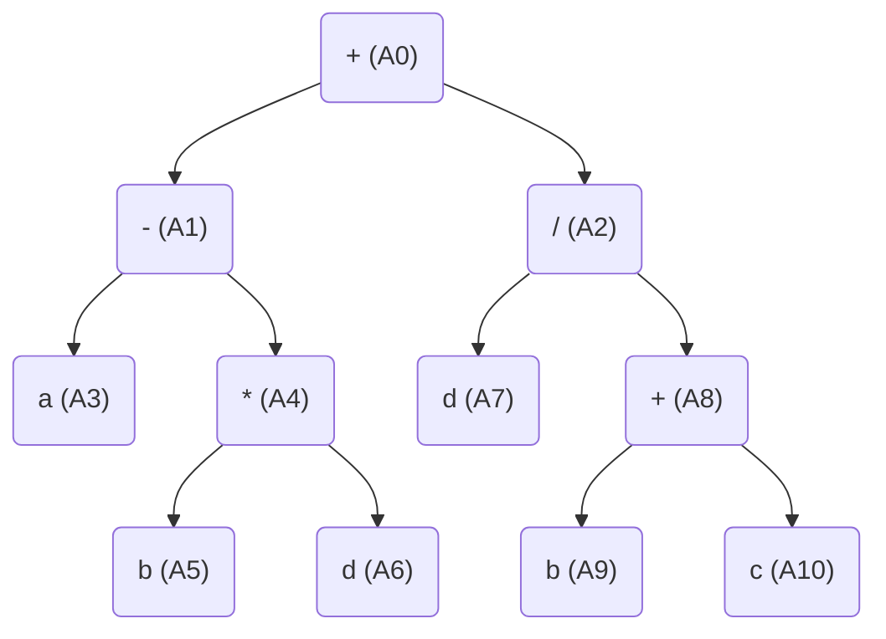
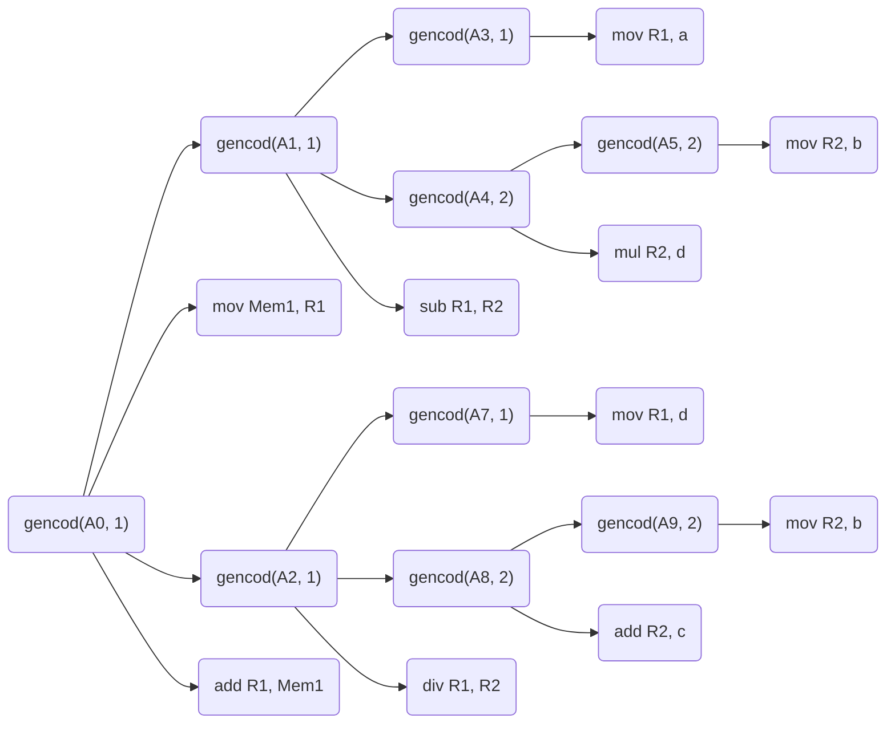

Tema: *Sethi-Ullman*.

A realizat: *Curmanschii Anton, MIA2201*.


## Sarcina

Utilizând modelul calculatorului cu 2 registre R_1 şi R_2 generaţi, aplicând algoritmul Sethi-Ullman, codul optimal pentru expresia  $ a - b * d + d / (b + c) $.

## Arborele de derivare



## Derivarea atributelor

A0: 3     

A3: 1 (a) 

A1: 2     

A2: 2     

A4: 1     

A9: 1 (b) 

A8: 1     

A10: 0 (c)

A5: 1 (b) 

A7: 1 (d) 

A6: 0 (d) 


## Codul

```
mov R1, a;    
mov R2, b;    
mul R2, d;    
sub R1, R2;   
mov Mem1, R1; 
mov R1, d;    
mov R2, b;    
add R2, c;    
div R1, R2;   
add R1, Mem1; 
```

