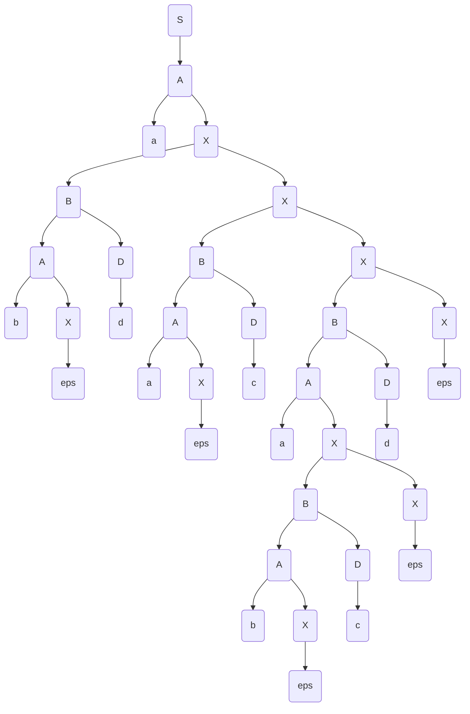
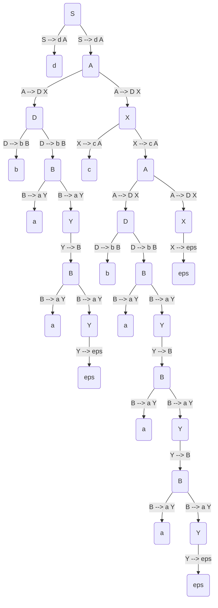
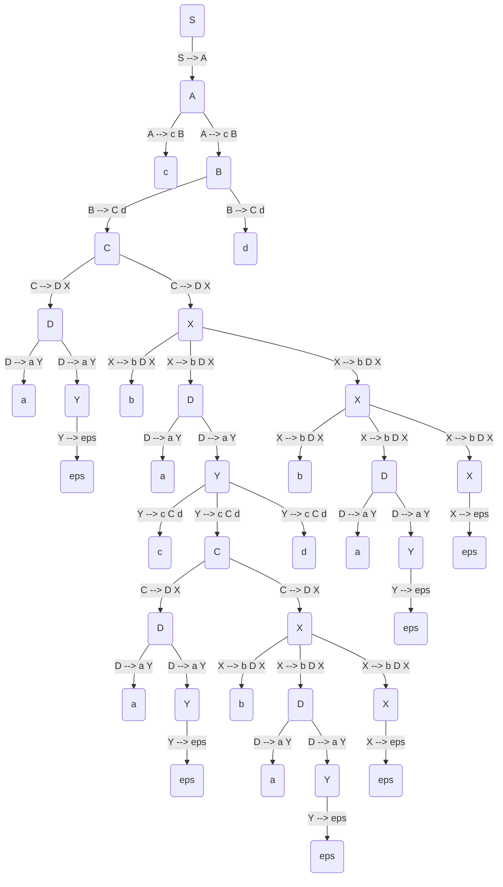

$ P = \begin{cases}
S \rightarrow A \\\\
A \rightarrow A B | a | b \\\\
B \rightarrow A D \\\\
D \rightarrow c | d \\\\
\end{cases}
$

Recursia stângă $ A \rightarrow A B $.
$ A \rightarrow a X | b X $, $ X \rightarrow B X | \varepsilon $

$ P _ 1 = \begin{cases} 
S \rightarrow A \\\\
B \rightarrow A D \\\\
D \rightarrow c | d \\\\
A \rightarrow a X | b X \\\\
X \rightarrow B X | \varepsilon \\\\
\end{cases}
$

SD - simbolul director.

$ SD(A \rightarrow a X) = primul(a X) = \\{ a \\} $

$ SD(A \rightarrow b X) = primul(b X) = \\{ b \\} $

$ SD(S \rightarrow A) = primul(A) = SD(A \rightarrow a X) \cup SD(A \rightarrow b X) = \\{ a, b \\} $

$ SD(B \rightarrow A D) = primul(A) = \\{ a, b \\} $

$ SD(X \rightarrow B X) = primul(B) = \\{ a, b \\} $

$ SD(D \rightarrow c) = \\{ c \\} $

$ SD(D \rightarrow d) = \\{ d \\} $

$ primul(D) = \\{ c, d \\} $

$ SD(X \rightarrow \varepsilon) = urmatorul(X) = urmatorul(A) = urmatorul(S) \cup urmatorul(D) $

După definiție, $ urmatorul(S) = \\{ \\$ \\} $.

$ SD(X \rightarrow \varepsilon) = urmatorul(S) \cup urmatorul(D) = \\{ \\$ \\} \cup \\{ c, d \\} = \\{ c, d, \\$ \\} $.

$ SD(X \rightarrow A) = \\{ a, b \\} $


|   | c | d | a | b | $ |
|---|---|---|---|---|---|
| c | + |   |   |   |   |
| d |   | + |   |   |   |
| a |   |   | + |   |   |
| b |   |   |   | + |   |
| $ |   |   |   |   | A |
| S |   |   |   |   |   |
| A |   |   |   |   |   |
| B |   |   |   |   |   |
| D |   |   |   |   |   |
| X |   |   |   |   |   |

Prima regulă $ S \rightarrow A $.





dbaacbaaa

```
S        | d b a a c b a a a
A d      | d b a a c b a a a
A        | b a a c b a a a
X D      | b a a c b a a a
X B b    | b a a c b a a a
X B      | a a c b a a a
X Y a    | a a c b a a a
X Y      | a c b a a a
X B      | a c b a a a
X Y a    | a c b a a a
X Y      | c b a a a
X        | c b a a a
A c      | c b a a a
A        | b a a a
X D      | b a a a
X B b    | b a a a
X B      | a a a
X Y a    | a a a
X Y      | a a
X B      | a a
X Y a    | a a
X Y      | a
X B      | a
X Y a    | a
X Y      | 
X        | 
```




```
S --> A              
A --> c B            
B --> C d            
C --> D X            
D --> a Y            
X --> b D X          
X --> eps            
Y --> eps            
Y --> c C d     

First(S) = {A, c}    
First(A) = {c}       
First(B) = {C, D, a} 
First(C) = {D, a}    
First(D) = {a}       
First(X) = {b, eps}  
First(Y) = {c, eps}  
First(c) = {c}       
First(d) = {d}       
First(b) = {b}       
First(a) = {a}       
First(eps) = {eps}   

Follow(S) = {$}      
Follow(A) = {$}      
Follow(B) = {$}      
Follow(C) = {d}      
Follow(D) = {d, b}   
Follow(X) = {d}      
Follow(Y) = {d, b}  
```

 - | c              | d            | b               | a            | $
--|----------------|--------------|-----------------|--------------|--
S | $ S --> A$     |              |                 |              |
A | $ A --> c B$   |              |                 |              |
B |                |              |                 | $ B --> C d$ |
C |                |              |                 | $ C --> D X$ |
D |                |              |                 | $ D --> a Y$ |
X |                | $ X --> eps$ | $ X --> b D X $ |              |
Y | $ Y --> c C d$ | $ Y --> eps$ | $ Y --> eps$    |              |


```
Enter input: cabacabadbad                                                                
Stack            Input                                
S                c a b a c a b a d b a d              
A                c a b a c a b a d b a d              
B c              c a b a c a b a d b a d              
B                a b a c a b a d b a d                
d C              a b a c a b a d b a d                
d X D            a b a c a b a d b a d                
d X Y a          a b a c a b a d b a d                
d X Y            b a c a b a d b a d                  
d X              b a c a b a d b a d                  
d X D b          b a c a b a d b a d                  
d X D            a c a b a d b a d                    
d X Y a          a c a b a d b a d                    
d X Y            c a b a d b a d                      
d X d C c        c a b a d b a d                      
d X d C          a b a d b a d                        
d X d X D        a b a d b a d                        
d X d X Y a      a b a d b a d                        
d X d X Y        b a d b a d                          
d X d X          b a d b a d                          
d X d X D b      b a d b a d                          
d X d X D        a d b a d                            
d X d X Y a      a d b a d                            
d X d X Y        d b a d                              
d X d X          d b a d                              
d X d            d b a d                              
d X              b a d                                
d X D b          b a d                                
d X D            a d                                  
d X Y a          a d                                  
d X Y            d                                    
d X              d                                    
d                d                                    
```



```
S matched production: S --> A
  A matched production: A --> c B
    c
    B matched production: B --> C d
      C matched production: C --> D X
        D matched production: D --> a Y
          a
          Y matched production: Y --> eps
            eps
        X matched production: X --> b D X
          b
          D matched production: D --> a Y
            a
            Y matched production: Y --> c C d
              c
              C matched production: C --> D X
                D matched production: D --> a Y
                  a
                  Y matched production: Y --> eps
                    eps
                X matched production: X --> b D X
                  b
                  D matched production: D --> a Y
                    a
                    Y matched production: Y --> eps
                      eps
                  X matched production: X --> eps
                    eps
              d
          X matched production: X --> b D X
            b
            D matched production: D --> a Y
              a
              Y matched production: Y --> eps
                eps
            X matched production: X --> eps
              eps
      d
```