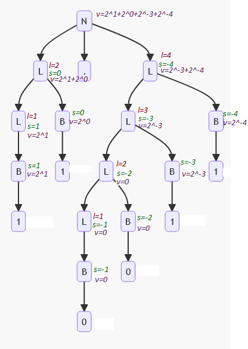

# Laborator 5 la Teoria Compilării și Semantica Limbajelor de Programare

Tema: *Knuth*.

A realizat: *Curmanschii Anton, MIA2201*.

Varianta: *5*.

## Sarcina

Fie gramatica independentă de context 

$ G = (V_N, V_T, P, S), V_N = \\{N, L, B \\}, V_T = \\{0, 1, .\\} $

$ P = \begin{cases}
N \rightarrow L \\\\
N \rightarrow L.L \\\\
L \rightarrow B \\\\
L \rightarrow L B \\\\
B \rightarrow 0 \\\\
B \rightarrow 1 \\\\
\end{cases} $

Utilizând gramatica atributivă a lui `G`.
Knuth cu atributul moştenit `s` (exponent) şi atributele sintetizate `l` (lungime), `v` (valoare) calculați valoarea zecimală a numărului binar `11.0011`.

| Reguli sintactice      | $ v $                 | $ s $                        | $ l $             |
|------------------------|-----------------------|------------------------------|-------------------|
| $ N \rightarrow L    $ | $ v.0 = v.1         $ | $ s.1 = 0                  $ | $               $ |
| $ N \rightarrow L.L  $ | $ v.0 = v.1 + v.3   $ | $ s.1 = 0, s.3 = -l.3      $ | $               $ |
| $ L \rightarrow L B  $ | $ v.0 = v.1 + v.2   $ | $ s.1 = s.0 + 1, s.2 = s.0 $ | $ l.0 = l.1 + 1 $ |
| $ L \rightarrow B    $ | $ v.0 = v.1         $ | $ s.1 = s.0                $ | $ l.0 = 1       $ |
| $ B \rightarrow 1    $ | $ v.0 = 1 * 2^{s.0} $ | $                          $ | $               $ |
| $ B \rightarrow 0    $ | $ v.0 = 0           $ | $                          $ | $               $ |

## Derivarea cuvântului

$ N \xrightarrow{N \rightarrow L.L} L.L $

$ L.L \xrightarrow{L \rightarrow L B} L B.L $

$ L B . L \xrightarrow{L \rightarrow B} B B . L $

$ B B . L \xrightarrow{B \rightarrow 1} 1 B . L $

$ 1 B . L \xrightarrow{B \rightarrow 1} 1 1 . L $

$ 1 1 . L \xrightarrow{L \rightarrow L B} 1 1 . L B $

$ 1 1 . L B \xrightarrow{L \rightarrow L B} 1 1 . L B B $

$ 1 1 . L B B \xrightarrow{L \rightarrow L B} 1 1 . L B B B $

$ 1 1 . L B B B \xrightarrow{L \rightarrow B} 1 1 . B B B B $

$ 1 1 . B B B B \xrightarrow{B \rightarrow 0} 1 1 . 0 B B B $

$ 1 1 . 0 B B B \xrightarrow{B \rightarrow 0} 1 1 . 0 0 B B $

$ 1 1 . 0 0 B B \xrightarrow{B \rightarrow 1} 1 1 . 0 0 1 B $

$ 1 1 . 0 0 1 B \xrightarrow{B \rightarrow 1} 1 1 . 0 0 1 1 $

## Arborele sintactic

## Derivarea atributelor

$ 2^1 + 2^0 + 2^{-3} + 2^{-4} = 2 + 1 + 0.125 + 0.0625 = 3.1875 $
