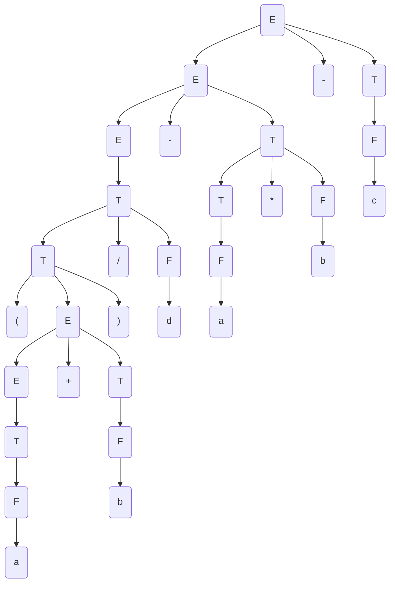
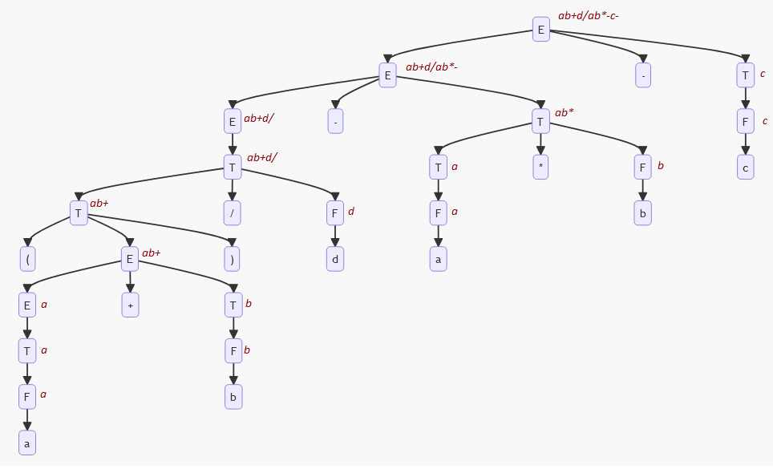

# Laborator 6 la Teoria Compilării și Semantica Limbajelor de Programare

Tema: *Notația poloneză (postfix)*.

A realizat: *Curmanschii Anton, MIA2201*.

Varianta: *5*.

## Sarcina

Fie gramatica independentă de context 

$ G = (V_N, V_T, P, S), V_N = \\{E, T, F \\}, V_T = \\{a ,b, c, +, -, *,/, (, )\\} $

$ P = \begin{cases}
E \rightarrow T \\\\
E \rightarrow E + T \\\\
E \rightarrow E - T \\\\
T \rightarrow T * F \\\\
T \rightarrow T / F \\\\
T \rightarrow F \\\\
F \rightarrow (E) \\\\
F \rightarrow a \\\\
F \rightarrow b \\\\
F \rightarrow c \\\\
\end{cases} $

Aplicând schema de traducere dirijată prin sintaxă cu atributul sintetizat *postfix* construiţi notaţia postfix pentru expresia $ (a + b) / d - a * b - c $.

| Reguli sintactice       | $ p $                   |
|-------------------------|-------------------------|
| $ E \rightarrow T $     | $ p.0 = p.1 $           |
| $ E \rightarrow E + T $ | $ p.0 = p.1 ~ p.3 ~ + $ |
| $ E \rightarrow E - T $ | $ p.0 = p.1 ~ p.3 ~ - $ |
| $ T \rightarrow T * F $ | $ p.0 = p.1 ~ p.3 ~ * $ |
| $ T \rightarrow T / F $ | $ p.0 = p.1 ~ p.3 ~ / $ |
| $ T \rightarrow F $     | $ p.0 = p.1 $           |
| $ F \rightarrow (E) $   | $ p.0 = p.2 $           |
| $ F \rightarrow a $     | $ p.0 = a $             |
| $ F \rightarrow b $     | $ p.0 = b $             |
| $ F \rightarrow c $     | $ p.0 = c $             |

## Derivarea

$ E \xrightarrow{E \rightarrow E - T} E - T $

$ E - T \xrightarrow{E \rightarrow E - T} E - T - T $

$ E - T - T \xrightarrow{E \rightarrow T} T - T - T $

$ T - T - T \xrightarrow{T \rightarrow T / F} T / F - T - T $

$ T / F - T - T \xrightarrow{T \rightarrow (E)} (E) / F - T - T $

$ (E) / F - T - T \xrightarrow{E \rightarrow E + T} (E + T) / F - T - T $

$ (E + T) / F - T - T \xrightarrow{E \rightarrow T} (T + T) / F - T - T $

$ (T + T) / F - T - T \xrightarrow{T \rightarrow F} (F + T) / F - T - T $

$ (F + T) / F - T - T \xrightarrow{F \rightarrow a} (a + T) / F - T - T $

$ (a + T) / F - T - T \xrightarrow{T \rightarrow F} (a + F) / F - T - T $

$ (a + F) / F - T - T \xrightarrow{F \rightarrow b} (a + b) / F - T - T $

$ (a + b) / F - T - T \xrightarrow{F \rightarrow d} (a + b) / d - T - T $

$ (a + b) / d - T - T \xrightarrow{T \rightarrow T * F} (a + b) / d - T * F - T $

$ (a + b) / d - T * F - T \xrightarrow{T \rightarrow F} (a + b) / d - F * F - T $

$ (a + b) / d - F * F - T \xrightarrow{F \rightarrow a} (a + b) / d - a * F - T $

$ (a + b) / d - a * F - T \xrightarrow{F \rightarrow b} (a + b) / d - a * b - T $

$ (a + b) / d - a * b - T \xrightarrow{T \rightarrow F} (a + b) / d - a * b - F $

$ (a + b) / d - a * b - F \xrightarrow{F \rightarrow c} (a + b) / d - a * b - c $

## Arborele sintactic

## Derivarea notației postfix

