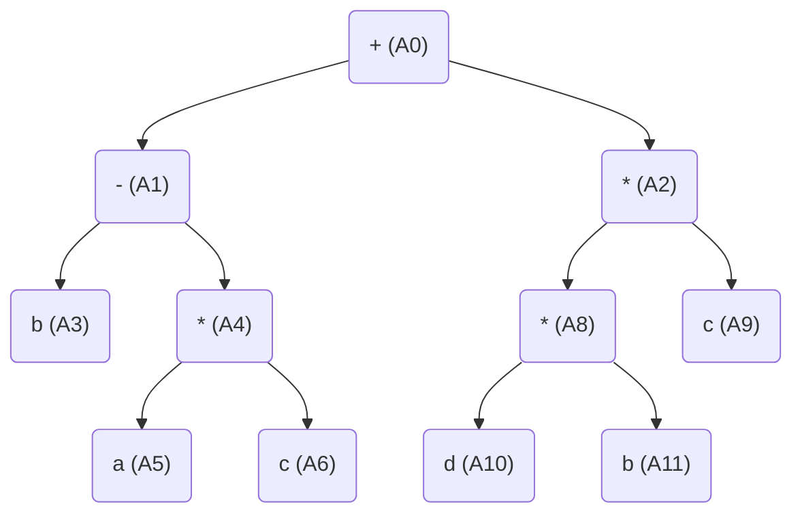
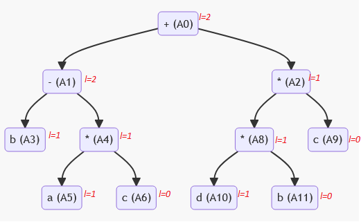

# Laborator 7 la Teoria Compilării și Semantica Limbajelor de Programare

Tema: *Algoritmul Sethi-Ullman*.

A realizat: *Curmanschii Anton, MIA2201*.

Varianta: *7*.


## Sarcina

Utilizând modelul calculatorului cu 2 registre R_1 şi R_2 generaţi,
aplicând algoritmul Sethi-Ullman, codul optimal pentru expresia $ (b-a * c)+d * b * c $.

<!-- (((b - (a * c))) + ((d * b) * c)) -->

## Arborele sintactic



## Derivarea atributelor

$ l_{A5} = 1, l_{A6} = 0; l_{A10} = 1, l_{A11} = 0 $

$ l_{A4} = max(1, 0) = 1 $

$ l_{A8} = max(1, 0) = 1 $

$ l_{A9} = 0; l_{A3} = 1 $

$ l_{A1} = 1 + 1 = 2 $

$ l_{A2} = max(1, 0) = 1 $

$ l_{A0} = max(2, 1) = 2 $




## Generarea codului

1. Se evaluează arborele cel mai lung primul (adică nodul are valoare $ l $ mai mare), iar rezultatul este mișcat în primul registru care este valabil;
2. Dacă $ l $ sunt egale, se calculează arborele din stânga, după ce acel din dreapta (deoarece operatorii necomutativi ca $ - $ sunt evaluați în așa ordine).
3. Dacă numărul necesar de regiștri este mai mare decât numărul de regiștri disponibil, rezultatul obținut după calculul valorii primilui arbore se pune în memorie. Numărul de regiștri necesar este egal cu valoarea lui $ l $.
4. Dacă valoarea lui $ l $ a unuia din copii este $ 0 $, atunci operația se realizează fără a-l pune în registru sau în memorie. 

```
result == translate(gencod(A0, 1));

gencod(A0, 1) == (regula 1.)
    gencod(A1, 1)
    gencod(A2, 2)
    R1 += R2

gencod(A1, 1) == (regula 2)
    gencod(A3, 1)
    gencod(A4, 2)
    R1 -= R2

gencod(A4, 2) == (regula 1, 4)
    gencod(A5, 2)
    R2 *= A6

gencod(A5, 2) == (nod terminal)
    R2 = A5

gencod(A4, 2) ==
    // gencod(A5, 2)
    R2 = A5

    R2 *= A6

gencod(A3, 2) == (nod terminal)
    R2 = A3

gencod(A1, 1) ==
    // gencod(A3, 1)
    R1 = A3

    // gencod(A4, 2)
    R2 = A5
    R2 *= A6
    
    R1 -= R2

gencod(A2, 2) == (regula 1, 4)
    gencod(A8, 2)
    R2 *= A9

gencod(A8, 2) == (regula 1, 4)
    gencod(A10, 2)
    R2 *= A11

gencod(A10, 2) == (nod terminal)
    R2 = A10

gencod(A8, 2) ==
    // gencod(A10, 2)
    R2 = A10

    R2 *= A11

gencod(A2, 2) ==
    // gencod(A8, 2)
    R2 = A10
    R2 *= A11

    R2 *= A9

gencod(A0, 1) ==
    // gencod(A1, 1)
    R1 = A3
    R2 = A5
    R2 *= A6
    R1 -= R2

    // gencod(A2, 2)
    R2 = A10
    R2 *= A11
    R2 *= A9

    R1 += R2

result == 
    // gencod(A1, 1)
    mov R1, A3
    mov R2, A5
    mul R2, A6
    sub R1, R2

    // gencod(A2, 2)
    mov R2, A10
    mul R2, A11
    mul R2, A9

    add R1, R2

result == 
    // gencod(A1, 1)
    mov R1, b
    mov R2, a
    mul R2, c
    sub R1, R2

    // gencod(A2, 2)
    mov R2, d
    mul R2, b
    mul R2, c

    add R1, R2
```