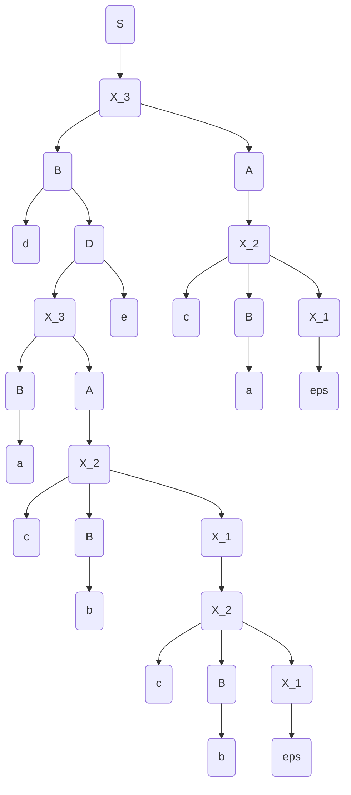

# Laborator 1 la Teoria Compilării și Semantica Limbajelor de Programare

Tema: *LL(1)*.

A realizat: *Curmanschii Anton, MIA2201*.

Varianta: *5*.


## Sarcina

Fie gramatica independentă de context 

$ G = (V_N, V_T, P, S), V_N = \\{S, A, B, D \\}, V_T = \\{a,b,c,d\\} $

$ P = \begin{cases}
S \rightarrow A \\\\
A \rightarrow B | AcB \\\\
B \rightarrow a | b | dD \\\\
D \rightarrow Ae \\\\
\end{cases} $


S
AcB
AcBcBcB
dacbccB

Să se construiască tabelul de analiză LL(1) şi să se analizeze şirul **dacbcbeca**.
Să se deseneze arborele de derivare.

## Normalizarea

Necesită să eliminăm recursia stângă.

Regula $ A \rightarrow AcB $ manifestă recursia stângă.
O eliminăm, introducând o regulile $ X_1 \rightarrow c B $, $ X_1 \rightarrow c B X_1 $,
și eliminând regula $ A \rightarrow AcB $, adaugând regula $ A \rightarrow B X_1 $.

$ P ^ {\prime} = \begin{cases}
S \rightarrow A \\\\
B \rightarrow a | b | d D \\\\
D \rightarrow A e \\\\
A \rightarrow B X_1 | B \\\\
X_1 \rightarrow c B | c B X_1 \\\\
\end{cases} $

Acum mai este necesar să se facă factorizarea.
Trebuie să factorizăm regulile lui $ X_1 $ (ambele se încep cu c B ).
Adaugăm o regulă nouă, $ X_2 \rightarrow c B X_1 $, și $ X_1 \rightarrow \varepsilon $, $ X_1 \rightarrow X_2 $.
Eliminăm regulile $ X_1 \rightarrow c B $ și $ X_1 \rightarrow c B X_1 $.
Substituim toate aparițiile lui $ X_1 $ la $ X_2 $ în toate alte reguli.

$ P ^ {\prime \prime} = \begin{cases}
S \rightarrow A \\\\
B \rightarrow a | b | d D \\\\
D \rightarrow A e \\\\
A \rightarrow B X_2 | B \\\\
X_2 \rightarrow c B X_1 \\\\
X_1 \rightarrow X_2 | \varepsilon \\\\
\end{cases} $

Gramatica rezulantă este echivalentă cu gramatica primită după eliminarea recursiei stânge introducând o regulă cu epsilon.

Trebuie să mai performăm factorizarea pentru $ A $ (ambele reguli se încep cu $ B $).
Adaugăm o regulă $ X_3 \rightarrow B A $, adaugăm regulile $ A \rightarrow X_2 $, $ A \rightarrow \varepsilon $, ștergem regulile veche lui $ A $. Toate aparițiile lui $ A $ în alte reguli se înlocuiesc cu $ X_3 $.

$ P ^ {\prime \prime \prime} = \begin{cases}
S \rightarrow X_3 \\\\
B \rightarrow a | b | d D \\\\
D \rightarrow X_3 e \\\\
X_2 \rightarrow c B X_1 \\\\
X_1 \rightarrow X_2 | \varepsilon \\\\
A \rightarrow X_2 | \varepsilon \\\\
X_3 \rightarrow B A \\\\
\end{cases} $


## Construirea tabelelor și analiza sintactică

Rulez [programul meu](https://github.com/AntonC9018/uni_compilers/blob/3cf8f73df367aa337bed9513e3011a0b2da9dff2/code/source/ll1/app.d) la această gramatică:


Inputul **dacbcbeca** nu se potrivește.

```
S --> X_3                                                                                           
X_3 --> B A                                                                                         
B --> a                                                                                             
B --> b                                                                                             
B --> d D                                                                                           
D --> X_3 e                                                                                         
A --> X_2                                                                                           
A --> eps                                                                                           
X_2 --> c B X_1                                                                                     
X_1 --> X_2                                                                                         
X_1 --> eps       

First(S) = {X_3, B, a, b, d}                                                                        
First(X_3) = {B, a, b, d}                                                                           
First(B) = {a, b, d}                                                                                
First(D) = {X_3, B, a, b, d}                                                                        
First(A) = {X_2, c, eps}                                                                            
First(X_2) = {c}                                                                                    
First(X_1) = {X_2, c, eps}                                                                          
First(a) = {a}                                                                                      
First(b) = {b}                                                                                      
First(d) = {d}                                                                                      
First(e) = {e}                                                                                      
First(c) = {c}                                                                                      
First(eps) = {eps}      

Follow(S) = {$}                                                                                     
Follow(X_3) = {e, $}                                                                                
Follow(B) = {e, c, $}                                                                               
Follow(D) = {e, c, $}                                                                               
Follow(A) = {e, $}                                                                                  
Follow(X_2) = {e, $}                                                                                
Follow(X_1) = {e, $}      

    |           a |           b |           d |           e |               c |           $ 
  S |   S --> X_3 |   S --> X_3 |   S --> X_3 |             |                 |             
X_3 | X_3 --> B A | X_3 --> B A | X_3 --> B A |             |                 |             
  B |     B --> a |     B --> b |   B --> d D |             |                 |             
  D | D --> X_3 e | D --> X_3 e | D --> X_3 e |             |                 |             
  A |             |             |             |   A --> eps |       A --> X_2 |   A --> eps 
X_2 |             |             |             |             | X_2 --> c B X_1 |             
X_1 |             |             |             | X_1 --> eps |     X_1 --> X_2 | X_1 --> eps 

Enter input: dacbcbeca                                                                              

Stack           Input                                           
S               d a c b c b e c a                               
X_3             d a c b c b e c a                               
A B             d a c b c b e c a                               
A D d           d a c b c b e c a                               
A D             a c b c b e c a                                 
A e X_3         a c b c b e c a                                 
A e A B         a c b c b e c a                                 
A e A a         a c b c b e c a                                 
A e A           c b c b e c a                                   
A e X_2         c b c b e c a                                   
A e X_1 B c     c b c b e c a                                   
A e X_1 B       b c b e c a                                     
A e X_1 b       b c b e c a                                     
A e X_1         c b e c a                                       
A e X_2         c b e c a                                       
A e X_1 B c     c b e c a                                       
A e X_1 B       b e c a                                         
A e X_1 b       b e c a                                         
A e X_1         e c a                                           
A e             e c a                                           
A               c a                                             
X_2             c a                                             
X_1 B c         c a                                             
X_1 B           a                                               
X_1 a           a                                               
X_1                  

S matched production: S --> X_3                        
  X_3 matched production: X_3 --> B A                  
    B matched production: B --> d D                    
      d                                                
      D matched production: D --> X_3 e                
        X_3 matched production: X_3 --> B A            
          B matched production: B --> a                
            a                                          
          A matched production: A --> X_2              
            X_2 matched production: X_2 --> c B X_1    
              c                                        
              B matched production: B --> b            
                b                                      
              X_1 matched production: X_1 --> X_2      
                X_2 matched production: X_2 --> c B X_1
                  c                                    
                  B matched production: B --> b        
                    b                                  
                  X_1 matched production: X_1 --> eps  
                    eps                                
        e                                              
    A matched production: A --> X_2                    
      X_2 matched production: X_2 --> c B X_1          
        c                                              
        B matched production: B --> a                  
          a                                            
        X_1 matched production: X_1 --> eps            
          eps                                                                                                                              
```

