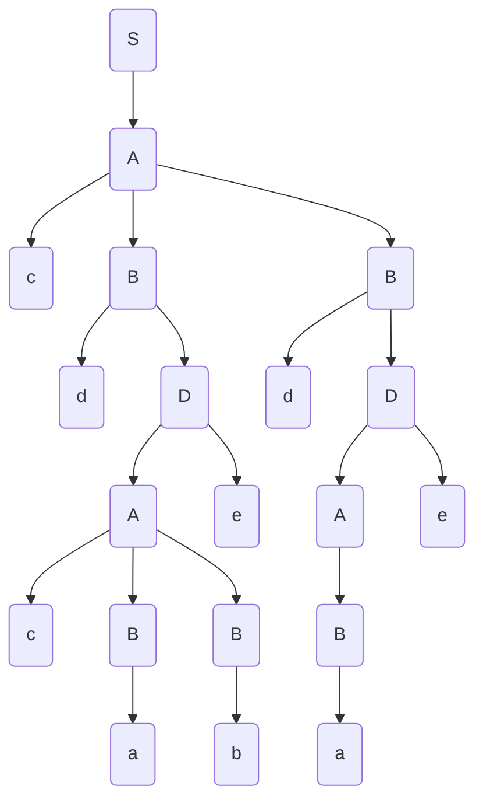

# Laborator 1 la Teoria Compilării și Semantica Limbajelor de Programare

Tema: *LL(1)*.

A realizat: *Curmanschii Anton, MIA2201*.

Varianta: *5*.


## Sarcina

Fie gramatica independentă de context 

$ G = (V_N, V_T, P, S), V_N = \\{S, A, B, D \\}, V_T = \\{a,b,c,d\\} \\
\begin{cases}
S \rightarrow A \\\\
A \rightarrow B | AcB \\\\
B \rightarrow a | b | dB \\\\
D \rightarrow Ae \\\\
\end{cases} $

Să se construiască tabelul de analiză LL(1) şi să se analizeze şirul **dacbcbeca**. Să se deseneze arborele de derivare.

## Realizarea

Rulez [programul meu](https://github.com/AntonC9018/uni_compilers/blob/5566defe6a0f04e0e39c6494df36b4de62af33d0/code/source/precedence/app.d) la această gramatică:

Am trebuit să schimb regula $ {A} \rightarrow {A c B} $ la $ {A} \rightarrow {c B B} $, deoarece fără cu această regulă gramatica nu este LL(1) - parsabilă.
Dar atunci și cuvântul **dacbcbeca** nu s-ar potrivi. De aceea voi selecta cuvântul **cdcabedae**.

```
S --> A
A --> B
A --> c B B
B --> a
B --> b
B --> d D
D --> A e

First(S) = {A, B, c, a, b, d}
First(A) = {B, c, a, b, d}
First(B) = {a, b, d}
First(D) = {A, B, c, a, b, d}
First(c) = {c}
First(a) = {a}
First(b) = {b}
First(d) = {d}
First(e) = {e}
First(eps) = {eps}

Follow(S) = {$}
Follow(A) = {e, $}
Follow(B) = {a, b, d, e, $}
Follow(D) = {a, b, d, e, $}

 |        c|        a|        b|        d|        e|        $
S|  S --> A|  S --> A|  S --> A|  S --> A|         |         
A|A --> c B|  A --> B|  A --> B|  A --> B|         |         
B|         |  B --> a|  B --> b|B --> d D|         |         
D|D --> A e|D --> A e|D --> A e|D --> A e|         |     

Enter input: cdcabedae                                               
Stack         Input            
S             c d c a b e d a e
A             c d c a b e d a e
B B c         c d c a b e d a e
B B           d c a b e d a e  
B D d         d c a b e d a e  
B D           c a b e d a e    
B e A         c a b e d a e    
B e B B c     c a b e d a e    
B e B B       a b e d a e      
B e B a       a b e d a e      
B e B         b e d a e        
B e b         b e d a e        
B e           e d a e          
B             d a e            
D d           d a e            
D             a e              
e A           a e              
e B           a e              
e a           a e              
e             e    

S matched production: S --> A            
  A matched production: A --> c B B      
    c                                    
    B matched production: B --> d D      
      d                                  
      D matched production: D --> A e    
        A matched production: A --> c B B
          c                              
          B matched production: B --> a  
            a                            
          B matched production: B --> b  
            b                            
        e                                
    B matched production: B --> d D      
      d                                  
      D matched production: D --> A e    
        A matched production: A --> B    
          B matched production: B --> a  
            a                            
        e                                
                                         
```

