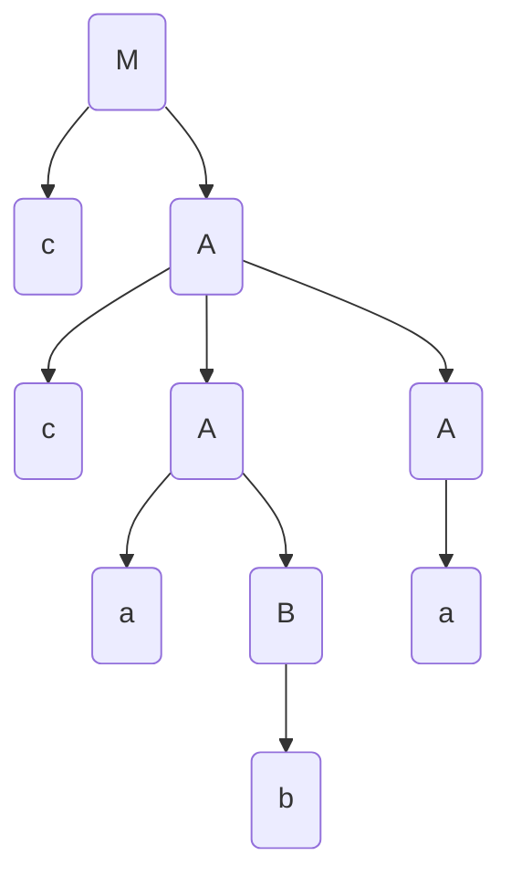

Tema: *Algoritmul Cocke-Younger-Kasami*.

A realizat: *Curmanschii Anton, MIA2201*.

## Sarcina

$ G=(V_N, V_T, P, M), V_N = \\{M, A, B\\}, V_T = \\{a, b, c, \\} $

$ P = \begin{cases}
M \rightarrow c A | a B \\\\
A \rightarrow c A A | a B | a \\\\
B \rightarrow a B B | a c | b \\\\
\end{cases} 
$

Generați un cuvânt alcătuit din 5-7 simboluri.

Efectuați analiza sintactică utilizând algoritmul Cocke-Younger-Kasami.

Desenați arborele de derivare.

## Generarea unui cuvânt

$ M \xrightarrow{M \rightarrow c A} c A $

$ c A \xrightarrow{A \rightarrow c A A} c c A A $

$ c c A A \xrightarrow{A \rightarrow a B} c c a B A $

$ c c a B A \xrightarrow{B \rightarrow b} c c a b A $

$ c c a b A \xrightarrow{A \rightarrow a} c c a b a $

## Normalizarea gramaticii

1. Se elimină $ \varepsilon $. Nu-s.
   
2. Se elimină regulile singulare. Nu-s.
   
3. Se elimină regulile inaccesibile. Toate regulile sunt evident accesibile.
   
4. Se elimină regulile inutile. Toate regulile sunt evident utile.

## Aducerea la forma normală Chomsky

$ M \rightarrow c A \xrightarrow{X_c \rightarrow c} M \rightarrow X_c A $.

$ M \rightarrow a B \xrightarrow{X_a \rightarrow a} M \rightarrow X_a B $.

$ A \rightarrow c A A \xrightarrow{Y_1 \rightarrow X_c A} A \rightarrow Y_1 A $.

$ B \rightarrow a B B \xrightarrow{Y_2 \rightarrow X_a B} A \rightarrow Y_2 B $.

$ P = \begin{cases}
M \rightarrow X_c A | X_a B \\\\
A \rightarrow Y_1 A | X_a B | a \\\\
B \rightarrow Y_2 B | X_a X_c | b \\\\
X_a \rightarrow a \\\\
X_c \rightarrow c \\\\
Y_1 \rightarrow X_c A \\\\
Y_2 \rightarrow X_a B \\\\
\end{cases} 
$

## Derivarea

| c       | c       | a         | b   | a       |
|---------|---------|-----------|-----|---------|
| $X_c$   | $X_c$   | $A,X_a$   | $B$ | $A,X_a$ |
| -       | $M,Y_1$ | $M,A,Y_2$ | -   |         |
| -       | $M,Y_1$ | -         |     |         |
| -       | $A$     |           |     |         |
| $M,Y_1$ |         |           |     |         |

