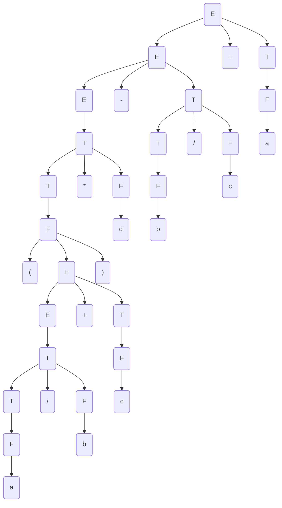
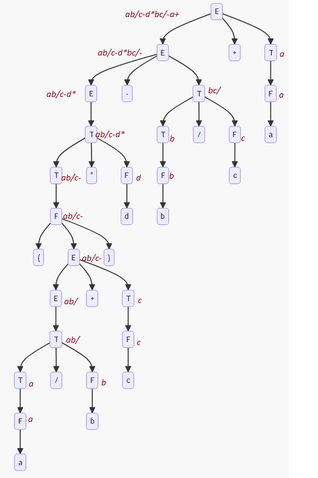

Tema: *Forma postfix*.

A realizat: *Curmanschii Anton, MIA2201*.

## Sarcina

Este dată gramatica independentă de context

$ G = (V_N, V_T, P, S), V_N = \\{E, T, F \\}, V_T = \\{a ,b, c, d, +, -, *,/, (, )\\} $

$ P = \begin{cases}
E \rightarrow T \\\\
E \rightarrow E + T \\\\
E \rightarrow E - T \\\\
T \rightarrow T * F \\\\
T \rightarrow T / F \\\\
T \rightarrow F \\\\
F \rightarrow (E) \\\\
F \rightarrow a \\\\
F \rightarrow b \\\\
F \rightarrow c \\\\
F \rightarrow d \\\\
\end{cases} $

Aplicând schema de traducere dirijată prin sintaxă cu atributul sintetizat postfix construiţi notaţia postfix pentru expresia  $ (a/b+c) * d-b/c+a $.

## Derivarea cuvântului

$ E \xrightarrow{E \rightarrow E + T} E + T $

$ E + T \xrightarrow{E \rightarrow E - T} E - T + T $

$ E - T - T \xrightarrow{E \rightarrow T} T - T + T $

$ T - T + T \xrightarrow{T \rightarrow T * F} T * F - T + T $

$ T * F - T + T \xrightarrow{T \rightarrow F} F * F - T + T $

$ F * F - T + T \xrightarrow{F \rightarrow ( E )} (E) * F - T + T $

$ (E) * F - T + T \xrightarrow{E \rightarrow E + T} (E + T) * F - T + T $

$ (E + T) * F - T + T \xrightarrow{E \rightarrow T} (T + T) * F - T + T $

$ (T + T) * F - T + T \xrightarrow{T \rightarrow T / F} (T / F + T) * F - T + T $

$ (T / F + T) * F - T + T \xrightarrow{T \rightarrow F} (F / F + T) * F - T + T $

$ (F / F + T) * F - T + T \xrightarrow{F \rightarrow a} (a / F + T) * F - T + T $

$ (a / F + T) * F - T + T \xrightarrow{F \rightarrow b} (a / b + T) * F - T + T $

$ (a / b + T) * F - T + T \xrightarrow{T \rightarrow F} (a / b + F) * F - T + T $

$ (a / b + F) * F - T + T \xrightarrow{F \rightarrow c} (a / b + c) * F - T + T $

$ (a / b + c) * F - T + T \xrightarrow{F \rightarrow d} (a / b + c) * d - T + T $

$ (a / b + c) * d - T + T \xrightarrow{T \rightarrow T / F} (a / b + c) * d - T / F + T $

$ (a / b + c) * d - T / F + T \xrightarrow{T \rightarrow F} (a / b + c) * d - F / F + T $

$ (a / b + c) * d - F / F + T \xrightarrow{F \rightarrow b} (a / b + c) * d - b / F + T $

$ (a / b + c) * d - b / F + T \xrightarrow{F \rightarrow c} (a / b + c) * d - b / c + T $

$ (a / b + c) * d - b / c + T \xrightarrow{T \rightarrow F} (a / b + c) * d - b / c + F $

$ (a / b + c) * d - b / c + F \xrightarrow{F \rightarrow a} (a / b + c) * d - b / c + a $

## Arborele de derivare

## Derivarea notației postfix

| Reguli sintactice       | $ p $                   |
|-------------------------|-------------------------|
| $ E \rightarrow T $     | $ p.0 = p.1 $           |
| $ E \rightarrow E + T $ | $ p.0 = p.1 ~ p.3 ~ + $ |
| $ E \rightarrow E - T $ | $ p.0 = p.1 ~ p.3 ~ - $ |
| $ T \rightarrow T * F $ | $ p.0 = p.1 ~ p.3 ~ * $ |
| $ T \rightarrow T / F $ | $ p.0 = p.1 ~ p.3 ~ / $ |
| $ T \rightarrow F $     | $ p.0 = p.1 $           |
| $ F \rightarrow (E) $   | $ p.0 = p.2 $           |
| $ F \rightarrow a $     | $ p.0 = a $             |
| $ F \rightarrow b $     | $ p.0 = b $             |
| $ F \rightarrow c $     | $ p.0 = c $             |
| $ F \rightarrow d $     | $ p.0 = d $             |

$ a b / c - d * b c / - a + $