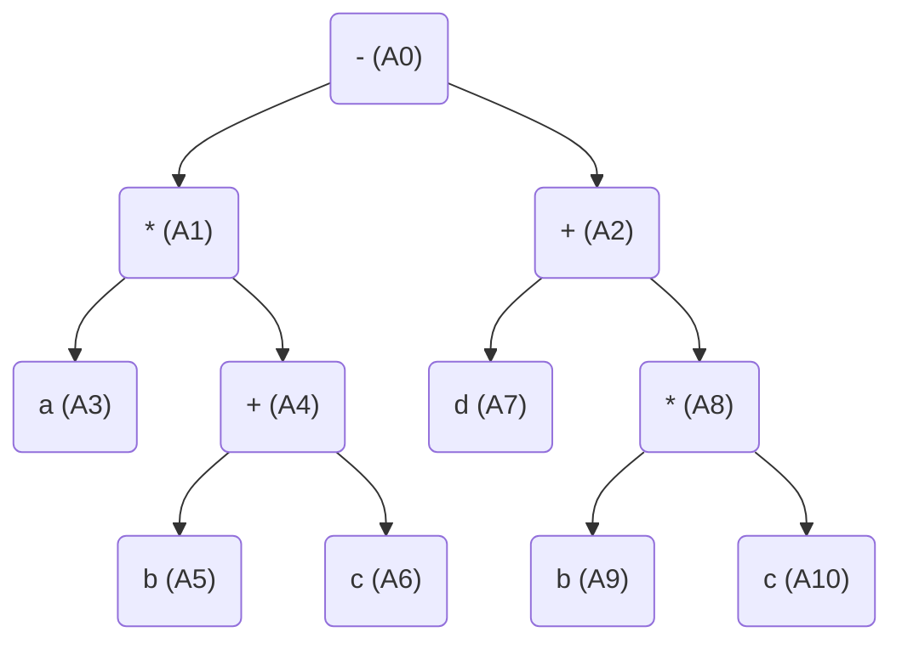
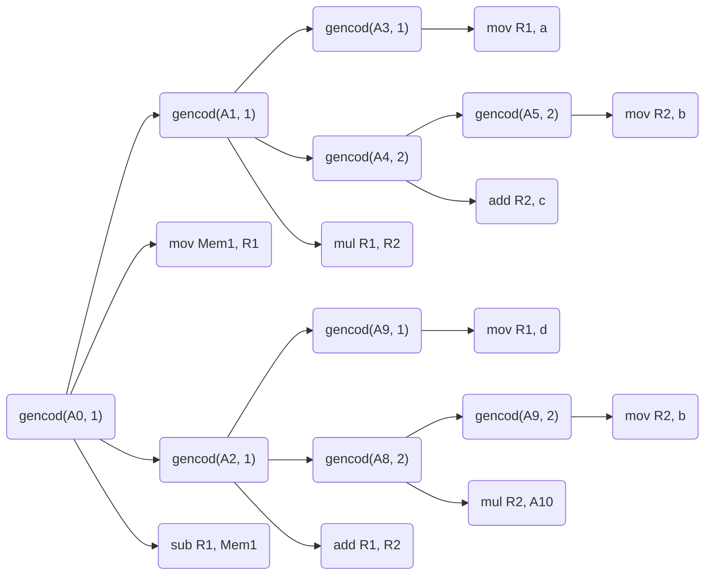

Tema: *Sethi-Ullman*.

A realizat: *Curmanschii Anton, MIA2201*.


## Sarcina

Utilizând modelul calculatorului cu 2 registre R_1 şi R_2 generaţi, aplicând algoritmul Sethi-Ullman, codul optimal pentru expresia  $ a * (b + c) - (d + b * c) $.

## Arborele de derivare



## Derivarea atributelor

$ A3: 1 (a) $

$ A5: 1 (b) $

$ A6: 0 (c) $

$ A7: 1 (d) $

$ A9: 1 (b) $

$ A10: 0 (c) $

$ A4: 1 $

$ A1: 2 $

$ A8: 1 $

$ A2: 2 $

$ A0: 3 $


## Codul

```
mov R1, a;
mov R2, b;
add R2, c;
mul R1, R2;
mov Mem1, R1;
mov R1, d;
mov R2, b;
mul R2, c;
add R1, R2;
sub R1, Mem1;
```

